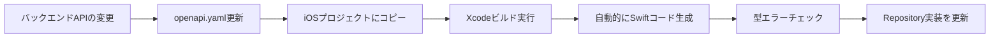

# iOSチャットクライアントアプリ - API接続レイヤー設計書

## 1. 概要

### 1.1 目的
OpenAPI仕様書からSwiftクライアントコードを自動生成し、型安全かつメンテナンス性の高いAPI通信レイヤーを構築する。

### 1.2 採用技術
**Apple公式: Swift OpenAPI Generator**

- **パッケージ**: `apple/swift-openapi-generator`
- **トランスポート**: `apple/swift-openapi-urlsession`
- **バージョン**: 1.0+
- **メンテナンス状況**: Appleによる公式サポート、2024年1月に1.0リリース、2025年も活発に開発中

### 1.3 選定理由

| 評価項目 | 説明 |
|---------|------|
| **公式サポート** | Apple公式パッケージで長期的なメンテナンスが保証 |
| **ビルド時生成** | コード生成がビルドプロセスに統合され、常にOpenAPI仕様と同期 |
| **型安全性** | 完全な型推論とSwiftの言語機能を活用 |
| **Swift Package Manager統合** | Xcodeネイティブサポート |
| **ストリーミング対応** | 大容量データやイベントストリームに対応 |
| **軽量性** | Foundation標準のURLSessionを使用 |

---

## 2. アーキテクチャ構成

### 2.1 レイヤー構造

```
┌─────────────────────────────────────────────────┐
│           Application Layer                     │
│        (ViewModel, Use Cases)                   │
└────────────────┬────────────────────────────────┘
                 │
┌────────────────▼────────────────────────────────┐
│        Repository Layer (手動実装)              │
│  - UserRepository                               │
│  - ConversationRepository                       │
│  - MessageRepository                            │
│  ※DTO → Domain Entity変換を担当                │
└────────────────┬────────────────────────────────┘
                 │
┌────────────────▼────────────────────────────────┐
│     Generated API Client (自動生成)             │
│  - Client (OpenAPI Generator)                   │
│  - Operations (型安全なメソッド)                 │
│  - Components (スキーマモデル)                   │
└────────────────┬────────────────────────────────┘
                 │
┌────────────────▼────────────────────────────────┐
│         Transport Layer                         │
│  - URLSessionTransport                          │
│  - HTTP通信の実行                                │
└─────────────────────────────────────────────────┘
```

### 2.2 責務分離

#### 自動生成コード (Generated)
- OpenAPI仕様からの型定義
- APIエンドポイントごとのメソッド
- リクエスト/レスポンスのシリアライゼーション
- HTTPメソッド、パス、クエリパラメータの構築

#### 手動実装コード (Manual)
- Repository実装
- DTO → Domain Entity変換
- ビジネスロジック層へのアダプター
- エラーハンドリングのカスタマイズ

---

## 3. セットアップ手順

### 3.1 依存関係の追加

**Package.swift (または Xcode SPM)**

```swift
dependencies: [
    .package(
        url: "https://github.com/apple/swift-openapi-generator",
        from: "1.0.0"
    ),
    .package(
        url: "https://github.com/apple/swift-openapi-runtime",
        from: "1.0.0"
    ),
    .package(
        url: "https://github.com/apple/swift-openapi-urlsession",
        from: "1.0.0"
    ),
]

targets: [
    .target(
        name: "PrototypeChatClientApp",
        dependencies: [
            .product(name: "OpenAPIRuntime", package: "swift-openapi-runtime"),
            .product(name: "OpenAPIURLSession", package: "swift-openapi-urlsession"),
        ],
        plugins: [
            .plugin(name: "OpenAPIGenerator", package: "swift-openapi-generator")
        ]
    )
]
```

### 3.2 プロジェクト構造

```
PrototypeChatClientApp/
├── PrototypeChatClientApp/
│   ├── openapi.yaml                          # OpenAPI仕様書 (ターゲットディレクトリ)
│   ├── openapi-generator-config.yaml        # ジェネレーター設定
│   │
│   └── Infrastructure/
│       └── Network/
│           ├── APIClient/
│           │   ├── APIClientFactory.swift   # Client生成ファクトリ (手動実装)
│           │   └── AppEnvironment.swift     # 環境設定 (手動実装)
│           │
│           ├── Error/
│           │   └── NetworkError.swift       # エラー定義 (手動実装)
│           │
│           ├── DTOs/                        # DTO拡張 (手動実装)
│           │   ├── UserDTO+Mapping.swift
│           │   ├── ConversationDTO+Mapping.swift
│           │   └── MessageDTO+Mapping.swift
│           │
│           └── Repositories/                # Repository実装 (手動実装)
│               ├── UserRepository.swift
│               ├── ConversationRepository.swift
│               └── MessageRepository.swift
│
├── DerivedData/                              # Xcode生成物 (gitignore)
│   └── Build/Intermediates.noindex/
│       └── BuildToolPluginIntermediates/
│           └── PrototypeChatClientApp.output/
│               └── PrototypeChatClientApp/
│                   └── OpenAPIGenerator/
│                       └── GeneratedSources/  # 自動生成コード (Build Plugin)
│                           ├── Client.swift   # APIクライアント
│                           └── Types.swift    # スキーマ型定義
│
└── Resources/
    └── openapi.yaml                          # OpenAPI仕様書バックアップ
```

**設計のポイント:**

1. **生成コードの配置**: DerivedData内に自動生成（Apple推奨アプローチ）
   - ビルド時に自動的に生成
   - gitには含めない
   - openapi.yaml更新時に自動的に再生成

2. **手動実装コードの配置**: Infrastructure/Network配下に整理
   - APIClient/: Client初期化とファクトリ
   - Error/: 共通エラー定義
   - DTOs/: Domain Entity変換ロジック
   - Repositories/: Repository実装

3. **OpenAPI仕様書の管理**:
   - PrototypeChatClientApp/openapi.yaml: Build Plugin用（gitignore）
   - Resources/openapi.yaml: バックアップとして保存（git管理）

### 3.3 ジェネレーター設定

**openapi-generator-config.yaml**

```yaml
generate:
  - types          # スキーマ型定義
  - client         # Clientクラス

accessModifier: internal

# 追加設定（オプション）
additionalImports:
  - Foundation
```

### 3.4 OpenAPI仕様書の配置

```bash
# バックエンドリポジトリから取得
curl -o openapi.yaml \
  https://raw.githubusercontent.com/[YOUR_REPO]/packages/openapi/openapi.yaml

# または、ローカル開発環境から
cp ../backend/packages/openapi/openapi.yaml ./openapi.yaml
```

---

## 4. 実装設計

### 4.1 APIClientファクトリ

**Data/Network/APIClientFactory.swift**

```swift
import OpenAPIRuntime
import OpenAPIURLSession
import Foundation

enum AppEnvironment {
    case development
    case production

    var baseURL: URL {
        switch self {
        case .development:
            return URL(string: "http://localhost:3000")!
        case .production:
            return URL(string: "https://prototype-hono-drizzle-backend.linnefromice.workers.dev")!
        }
    }

    static var current: AppEnvironment {
        #if DEBUG
        return .development
        #else
        return .production
        #endif
    }
}

class APIClientFactory {
    static func createClient(environment: AppEnvironment = .current) -> Client {
        let transport = URLSessionTransport()

        return Client(
            serverURL: environment.baseURL,
            transport: transport,
            middlewares: [
                // 必要に応じてミドルウェア追加
                LoggingMiddleware(),
                ErrorHandlingMiddleware()
            ]
        )
    }
}
```

### 4.2 Repository実装例

**Data/Repositories/UserRepository.swift**

```swift
import Foundation
import OpenAPIRuntime

protocol UserRepositoryProtocol {
    func fetchUsers() async throws -> [User]
    func createUser(name: String, avatarUrl: String?) async throws -> User
    func fetchUser(id: String) async throws -> User
}

class UserRepository: UserRepositoryProtocol {
    private let client: Client

    init(client: Client) {
        self.client = client
    }

    func fetchUsers() async throws -> [User] {
        let response = try await client.getUsers()

        switch response {
        case .ok(let okResponse):
            let users = try okResponse.body.json
            return users.map { $0.toDomain() }

        case .undocumented(statusCode: let code, _):
            throw NetworkError.serverError(statusCode: code, message: nil)
        }
    }

    func createUser(name: String, avatarUrl: String?) async throws -> User {
        let request = Operations.createUser.Input(
            body: .json(
                Components.Schemas.CreateUserRequest(
                    name: name,
                    avatarUrl: avatarUrl
                )
            )
        )

        let response = try await client.createUser(request)

        switch response {
        case .ok(let okResponse):
            let userDTO = try okResponse.body.json
            return userDTO.toDomain()

        case .badRequest(let errorResponse):
            let error = try errorResponse.body.json
            throw NetworkError.validationError(message: error.message)

        case .undocumented(statusCode: let code, _):
            throw NetworkError.serverError(statusCode: code, message: nil)
        }
    }

    func fetchUser(id: String) async throws -> User {
        let response = try await client.getUser(
            path: .init(userId: id)
        )

        switch response {
        case .ok(let okResponse):
            let userDTO = try okResponse.body.json
            return userDTO.toDomain()

        case .notFound:
            throw NetworkError.notFound

        case .undocumented(statusCode: let code, _):
            throw NetworkError.serverError(statusCode: code, message: nil)
        }
    }
}
```

### 4.3 DTO → Domain Entity変換

**Data/DTOs/UserDTO+Mapping.swift**

```swift
import Foundation

// 生成された型を拡張
extension Components.Schemas.User {
    func toDomain() -> User {
        return User(
            id: self.id,
            name: self.name,
            avatarUrl: self.avatarUrl,
            createdAt: ISO8601DateFormatter().date(from: self.createdAt) ?? Date()
        )
    }
}

extension Components.Schemas.Conversation {
    func toDomain() -> Conversation {
        return Conversation(
            id: self.id,
            type: ConversationType(rawValue: self.type.rawValue) ?? .direct,
            name: self.name,
            createdAt: ISO8601DateFormatter().date(from: self.createdAt) ?? Date(),
            participants: self.participants?.map { $0.toDomain() } ?? []
        )
    }
}

extension Components.Schemas.Message {
    func toDomain() -> Message {
        return Message(
            id: self.id,
            conversationId: self.conversationId,
            senderUserId: self.senderUserId,
            type: MessageType(rawValue: self.type.rawValue) ?? .text,
            text: self.text,
            replyToMessageId: self.replyToMessageId,
            systemEvent: self.systemEvent.flatMap { SystemEvent(rawValue: $0.rawValue) },
            createdAt: ISO8601DateFormatter().date(from: self.createdAt) ?? Date()
        )
    }
}
```

### 4.4 エラーハンドリング

**Data/Network/NetworkErrorMapper.swift**

```swift
import Foundation
import OpenAPIRuntime

enum NetworkError: LocalizedError {
    case invalidURL
    case noData
    case decodingError(Error)
    case validationError(message: String)
    case notFound
    case unauthorized
    case serverError(statusCode: Int, message: String?)
    case networkFailure(Error)
    case unknown

    var errorDescription: String? {
        switch self {
        case .invalidURL:
            return "無効なURLです"
        case .noData:
            return "データが取得できませんでした"
        case .decodingError(let error):
            return "データの解析に失敗しました: \(error.localizedDescription)"
        case .validationError(let message):
            return "入力エラー: \(message)"
        case .notFound:
            return "リソースが見つかりませんでした"
        case .unauthorized:
            return "認証が必要です"
        case .serverError(let code, let message):
            return "サーバーエラー (\(code)): \(message ?? "不明なエラー")"
        case .networkFailure(let error):
            return "通信エラー: \(error.localizedDescription)"
        case .unknown:
            return "不明なエラーが発生しました"
        }
    }
}

// OpenAPIのエラーレスポンスをマッピング
extension NetworkError {
    static func from(statusCode: Int) -> NetworkError {
        switch statusCode {
        case 400:
            return .validationError(message: "不正なリクエストです")
        case 401:
            return .unauthorized
        case 404:
            return .notFound
        case 500...599:
            return .serverError(statusCode: statusCode, message: nil)
        default:
            return .unknown
        }
    }
}
```

---

## 5. 主要API実装パターン

### 5.1 GETリクエスト（一覧取得）

```swift
// 会話一覧取得
func fetchConversations(userId: String) async throws -> [Conversation] {
    let response = try await client.getConversations(
        query: .init(userId: userId)
    )

    switch response {
    case .ok(let okResponse):
        let conversations = try okResponse.body.json
        return conversations.map { $0.toDomain() }

    case .undocumented(statusCode: let code, _):
        throw NetworkError.from(statusCode: code)
    }
}
```

### 5.2 GETリクエスト（詳細取得）

```swift
// 会話詳細取得
func fetchConversation(id: String) async throws -> Conversation {
    let response = try await client.getConversation(
        path: .init(id: id)
    )

    switch response {
    case .ok(let okResponse):
        let conversation = try okResponse.body.json
        return conversation.toDomain()

    case .notFound:
        throw NetworkError.notFound

    case .undocumented(statusCode: let code, _):
        throw NetworkError.from(statusCode: code)
    }
}
```

### 5.3 POSTリクエスト（作成）

```swift
// メッセージ送信
func sendMessage(
    conversationId: String,
    senderUserId: String,
    text: String,
    replyToMessageId: String? = nil
) async throws -> Message {
    let request = Operations.sendMessage.Input(
        path: .init(id: conversationId),
        body: .json(
            Components.Schemas.SendMessageRequest(
                senderUserId: senderUserId,
                text: text,
                replyToMessageId: replyToMessageId
            )
        )
    )

    let response = try await client.sendMessage(request)

    switch response {
    case .ok(let okResponse):
        let message = try okResponse.body.json
        return message.toDomain()

    case .badRequest(let errorResponse):
        let error = try errorResponse.body.json
        throw NetworkError.validationError(message: error.message ?? "不正なリクエスト")

    case .undocumented(statusCode: let code, _):
        throw NetworkError.from(statusCode: code)
    }
}
```

### 5.4 POSTリクエスト（更新）

```swift
// 既読位置更新
func updateReadPosition(
    conversationId: String,
    userId: String,
    lastReadMessageId: String
) async throws {
    let request = Operations.updateReadPosition.Input(
        path: .init(id: conversationId),
        body: .json(
            Components.Schemas.UpdateReadRequest(
                userId: userId,
                lastReadMessageId: lastReadMessageId
            )
        )
    )

    let response = try await client.updateReadPosition(request)

    switch response {
    case .ok:
        return // 成功

    case .badRequest(let errorResponse):
        let error = try errorResponse.body.json
        throw NetworkError.validationError(message: error.message ?? "不正なリクエスト")

    case .undocumented(statusCode: let code, _):
        throw NetworkError.from(statusCode: code)
    }
}
```

### 5.5 DELETEリクエスト

```swift
// ブックマーク削除
func removeBookmark(messageId: String, userId: String) async throws {
    let response = try await client.deleteBookmark(
        path: .init(id: messageId),
        query: .init(userId: userId)
    )

    switch response {
    case .ok:
        return // 成功

    case .notFound:
        throw NetworkError.notFound

    case .undocumented(statusCode: let code, _):
        throw NetworkError.from(statusCode: code)
    }
}
```

### 5.6 ページネーション対応

```swift
// メッセージ一覧取得（ページネーション）
func fetchMessages(
    conversationId: String,
    userId: String,
    limit: Int = 50,
    before: Date? = nil
) async throws -> [Message] {
    let beforeString = before.map { ISO8601DateFormatter().string(from: $0) }

    let response = try await client.getMessages(
        path: .init(id: conversationId),
        query: .init(
            userId: userId,
            limit: limit,
            before: beforeString
        )
    )

    switch response {
    case .ok(let okResponse):
        let messages = try okResponse.body.json
        return messages.map { $0.toDomain() }

    case .undocumented(statusCode: let code, _):
        throw NetworkError.from(statusCode: code)
    }
}
```

---

## 6. ミドルウェア設計

### 6.1 ロギングミドルウェア

```swift
import OpenAPIRuntime
import Foundation

struct LoggingMiddleware: ClientMiddleware {
    func intercept(
        _ request: HTTPRequest,
        body: HTTPBody?,
        baseURL: URL,
        operationID: String,
        next: (HTTPRequest, HTTPBody?, URL) async throws -> (HTTPResponse, HTTPBody?)
    ) async throws -> (HTTPResponse, HTTPBody?) {
        print("🌐 API Request: \(operationID)")
        print("   URL: \(baseURL.appendingPathComponent(request.path ?? ""))")
        print("   Method: \(request.method)")

        let start = Date()
        let (response, responseBody) = try await next(request, body, baseURL)
        let duration = Date().timeIntervalSince(start)

        print("✅ API Response: \(operationID)")
        print("   Status: \(response.statusCode)")
        print("   Duration: \(String(format: "%.2f", duration))s")

        return (response, responseBody)
    }
}
```

### 6.2 エラーハンドリングミドルウェア

```swift
struct ErrorHandlingMiddleware: ClientMiddleware {
    func intercept(
        _ request: HTTPRequest,
        body: HTTPBody?,
        baseURL: URL,
        operationID: String,
        next: (HTTPRequest, HTTPBody?, URL) async throws -> (HTTPResponse, HTTPBody?)
    ) async throws -> (HTTPResponse, HTTPBody?) {
        do {
            return try await next(request, body, baseURL)
        } catch {
            // ネットワークエラーの詳細ログ
            print("❌ API Error: \(operationID)")
            print("   Error: \(error.localizedDescription)")
            throw NetworkError.networkFailure(error)
        }
    }
}
```

---

## 7. テスト戦略

### 7.1 Mockトランスポート

```swift
import OpenAPIRuntime

class MockTransport: ClientTransport {
    var responses: [String: (HTTPResponse, HTTPBody?)] = [:]

    func send(
        _ request: HTTPRequest,
        body: HTTPBody?,
        baseURL: URL,
        operationID: String
    ) async throws -> (HTTPResponse, HTTPBody?) {
        guard let response = responses[operationID] else {
            throw NetworkError.unknown
        }
        return response
    }
}
```

### 7.2 Repository単体テスト

```swift
import XCTest
@testable import PrototypeChatClientApp

class UserRepositoryTests: XCTestCase {
    var sut: UserRepository!
    var mockTransport: MockTransport!
    var mockClient: Client!

    override func setUp() {
        super.setUp()
        mockTransport = MockTransport()
        mockClient = Client(
            serverURL: URL(string: "http://localhost:3000")!,
            transport: mockTransport
        )
        sut = UserRepository(client: mockClient)
    }

    func testFetchUsers_Success() async throws {
        // Given
        let mockResponse = HTTPResponse(statusCode: 200)
        let mockBody = HTTPBody(/* JSONデータ */)
        mockTransport.responses["getUsers"] = (mockResponse, mockBody)

        // When
        let users = try await sut.fetchUsers()

        // Then
        XCTAssertEqual(users.count, 2)
        XCTAssertEqual(users.first?.name, "Test User")
    }

    func testCreateUser_ValidationError() async throws {
        // Given
        let mockResponse = HTTPResponse(statusCode: 400)
        let mockBody = HTTPBody(/* エラーJSON */)
        mockTransport.responses["createUser"] = (mockResponse, mockBody)

        // When & Then
        do {
            _ = try await sut.createUser(name: "", avatarUrl: nil)
            XCTFail("Expected error to be thrown")
        } catch let error as NetworkError {
            if case .validationError = error {
                // Success
            } else {
                XCTFail("Expected validation error")
            }
        }
    }
}
```

---

## 8. 開発ワークフロー

### 8.1 OpenAPI仕様の更新フロー



### 8.2 コード生成の確認

```bash
# Build Plugin はXcodeビルド時に自動実行される
make build

# 生成されたファイルの確認
find DerivedData/Build/Intermediates.noindex/ \
  -name "*.swift" \
  -path "*/OpenAPIGenerator/GeneratedSources/*"

# 生成コードの内容確認
find DerivedData/Build/Intermediates.noindex/ \
  -name "Client.swift" \
  -path "*/OpenAPIGenerator/GeneratedSources/*" \
  -exec head -20 {} \;
```

**注意事項:**

- 生成コードはビルド成果物としてDerivedDataに配置される
- Xcodeがインデックスを自動的に認識し、コード補完やナビゲーションに利用可能
- `make clean` を実行すると生成コードも削除されるため、再ビルドが必要

### 8.3 CI/CD統合

**GitHub Actions例**

```yaml
name: iOS Build

on: [push, pull_request]

jobs:
  build:
    runs-on: macos-latest
    steps:
      - uses: actions/checkout@v3

      - name: Download OpenAPI Spec
        run: |
          curl -o openapi.yaml \
            https://raw.githubusercontent.com/YOUR_REPO/main/packages/openapi/openapi.yaml

      - name: Build iOS App
        run: |
          xcodebuild clean build \
            -scheme PrototypeChatClientApp \
            -destination 'platform=iOS Simulator,name=iPhone 15'

      - name: Run Tests
        run: |
          xcodebuild test \
            -scheme PrototypeChatClientApp \
            -destination 'platform=iOS Simulator,name=iPhone 15'
```

---

## 9. パフォーマンス最適化

### 9.1 リクエストのバッチ処理

```swift
// 複数の未読数を並行取得
func fetchUnreadCounts(conversationIds: [String], userId: String) async throws -> [String: Int] {
    try await withThrowingTaskGroup(of: (String, Int).self) { group in
        for conversationId in conversationIds {
            group.addTask {
                let count = try await self.fetchUnreadCount(
                    conversationId: conversationId,
                    userId: userId
                )
                return (conversationId, count)
            }
        }

        var results: [String: Int] = [:]
        for try await (id, count) in group {
            results[id] = count
        }
        return results
    }
}
```

### 9.2 キャッシング戦略

```swift
actor APICache {
    private var cache: [String: (data: Any, timestamp: Date)] = [:]
    private let ttl: TimeInterval = 60 // 60秒

    func get<T>(key: String) -> T? {
        guard let entry = cache[key],
              Date().timeIntervalSince(entry.timestamp) < ttl else {
            return nil
        }
        return entry.data as? T
    }

    func set<T>(key: String, value: T) {
        cache[key] = (data: value, timestamp: Date())
    }

    func invalidate(key: String) {
        cache.removeValue(forKey: key)
    }
}

// Repository内での使用
class ConversationRepository {
    private let cache = APICache()

    func fetchConversations(userId: String, useCache: Bool = true) async throws -> [Conversation] {
        let cacheKey = "conversations_\(userId)"

        if useCache, let cached: [Conversation] = await cache.get(key: cacheKey) {
            return cached
        }

        let conversations = try await client.getConversations(/* ... */)
        await cache.set(key: cacheKey, value: conversations)
        return conversations
    }
}
```

---

## 10. セキュリティ考慮事項

### 10.1 App Transport Security設定

**Info.plist (開発環境用)**

```xml
<key>NSAppTransportSecurity</key>
<dict>
    <key>NSAllowsLocalNetworking</key>
    <true/>
    <!-- 本番環境ではHTTPSのみ許可 -->
    <key>NSExceptionDomains</key>
    <dict>
        <key>localhost</key>
        <dict>
            <key>NSExceptionAllowsInsecureHTTPLoads</key>
            <true/>
        </dict>
    </dict>
</dict>
```

### 10.2 機密情報の管理

```swift
// 環境変数からAPIキーを取得（将来的な認証実装用）
enum APIConfiguration {
    static var apiKey: String? {
        ProcessInfo.processInfo.environment["API_KEY"]
    }
}

// ミドルウェアで認証ヘッダーを追加
struct AuthenticationMiddleware: ClientMiddleware {
    let apiKey: String

    func intercept(
        _ request: HTTPRequest,
        body: HTTPBody?,
        baseURL: URL,
        operationID: String,
        next: (HTTPRequest, HTTPBody?, URL) async throws -> (HTTPResponse, HTTPBody?)
    ) async throws -> (HTTPResponse, HTTPBody?) {
        var mutableRequest = request
        mutableRequest.headerFields.append(.init(
            name: "Authorization",
            value: "Bearer \(apiKey)"
        ))
        return try await next(mutableRequest, body, baseURL)
    }
}
```

---

## 11. トラブルシューティング

### 11.1 よくある問題

| 問題 | 原因 | 解決策 |
|------|------|--------|
| コード生成されない | openapi.yamlが見つからない | ファイルパスを確認、ターゲットに追加 |
| ビルドエラー: 型が見つからない | 生成コードがtargetに含まれていない | Build Phasesを確認 |
| 実行時エラー: URLが無効 | baseURLの設定ミス | AppEnvironmentの確認 |
| デコードエラー | OpenAPI仕様とAPIレスポンスの不一致 | バックエンドの仕様を確認 |

### 11.2 デバッグ手法

```swift
// 詳細なHTTPログ出力
struct VerboseLoggingMiddleware: ClientMiddleware {
    func intercept(
        _ request: HTTPRequest,
        body: HTTPBody?,
        baseURL: URL,
        operationID: String,
        next: (HTTPRequest, HTTPBody?, URL) async throws -> (HTTPResponse, HTTPBody?)
    ) async throws -> (HTTPResponse, HTTPBody?) {
        // リクエストボディのログ
        if let body = body {
            let data = try await Data(collecting: body, upTo: 1024 * 1024) // 1MB
            if let jsonString = String(data: data, encoding: .utf8) {
                print("📤 Request Body: \(jsonString)")
            }
        }

        let (response, responseBody) = try await next(request, body, baseURL)

        // レスポンスボディのログ
        if let responseBody = responseBody {
            let data = try await Data(collecting: responseBody, upTo: 1024 * 1024)
            if let jsonString = String(data: data, encoding: .utf8) {
                print("📥 Response Body: \(jsonString)")
            }
        }

        return (response, responseBody)
    }
}
```

---

## 12. 今後の拡張計画

### 12.1 認証機能の追加
- JWTトークンベースの認証
- リフレッシュトークン自動更新
- 認証エラー時の自動リトライ

### 12.2 オフラインサポート
- リクエストキューイング
- ローカルDBとの同期
- 競合解決メカニズム

### 12.3 WebSocket統合
- リアルタイム更新用のWebSocket接続
- RESTとWebSocketのハイブリッド構成
- 自動再接続機能

---

## 13. 参考リンク

### 13.1 公式ドキュメント
- [Swift OpenAPI Generator - GitHub](https://github.com/apple/swift-openapi-generator)
- [Swift OpenAPI URLSession - GitHub](https://github.com/apple/swift-openapi-urlsession)
- [Swift OpenAPI Generator - WWDC23 Session](https://developer.apple.com/videos/play/wwdc2023/10171/)
- [Swift.org - Introducing Swift OpenAPI Generator](https://www.swift.org/blog/introducing-swift-openapi-generator/)

### 13.2 関連ドキュメント
- [アーキテクチャ概要設計書](./IOS_APP_ARCHITECTURE_20251211_JA.md)
- [クライアント要件書](../Design/CLIENT_REQUIREMENTS_20251211_JA.md)

---

**ドキュメント作成日**: 2025年12月11日
**Swift OpenAPI Generator バージョン**: 1.0+
**対象iOS**: 16.0+
**作成者**: iOS Development Team
